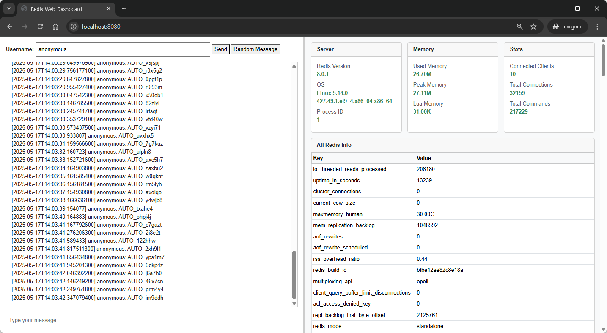

# Redis Web Chat (Spring Boot)
This is a simple web-based chat application built using **Spring Boot** and **Redis**.  
It demonstrates real-time messaging via WebSocket and uses Redis for message brokering and key-value storage.

## 🔧 Tech Stack

- Java 21+
- Spring Boot
- Redis
- WebSocket (custom handler, no STOMP)
- Gradle
- Thymeleaf (UI)
- VS Code (as development environment)

---

## 📦 Requirements

- Java 21 or higher
- Redis (local or remote)
- Visual Studio Code  
  Recommended Extension: [Java Extension Pack](https://marketplace.visualstudio.com/items?itemName=vscjava.vscode-java-pack)
- Gradle (bundled or installed separately)

---

## 🚀 Getting Started with VS Code

### 1. Clone or extract the project

Open the extracted project folder in VS Code:
```
File > Open Folder...
```

### 2. Start Redis (Optional: Docker-based)

If you don't have Redis running locally, you can use Docker:

```bash
docker run -d --name redis -p 6379:6379 redis:7
```

### 3. Build the project

In the terminal or Gradle Tasks pane:

```bash
./gradlew build
```

> On Windows, use `gradlew.bat build`

### 4. Run the application

```bash
./gradlew bootRun
```

Once started, access the chat at:  
📍 `http://localhost:8080/chat`

---

## 🗂 Project Structure

- `WebChatController.java`: Loads the main chat view.
- `ChatHandler.java`: Handles incoming WebSocket messages.
- `KeyValueController.java`: Simple API to retrieve key-value data from Redis.
- `InfoController.java`: Returns system/Redis status info.
- `application.yml`: App configuration.

---

## 🧪 Example Endpoints

- **Web Chat UI**
  ```
  GET /chat
  ```

- **Get Redis key value**
  ```
  GET /kv/{key}
  ```


---

## 🛠 Troubleshooting

- **Redis not connected**: Make sure Redis is accessible at `localhost:6379`
- **Port conflict**: Modify `server.port` in `application.yml`
- **WebSocket issues**: Use a modern browser, disable any interfering browser plugins or proxies

---

## 🤝 Contributions

This project is for educational and demonstration purposes.  
Feel free to contribute by submitting a pull request.
